Developed by Kaile Wei

This Project was designed and implemented for the capstone project.

PHP, MySQL, HTML, CSS, JavaScript were used in this project.

The project was aiming to implement following functions:
* Both students and advisors could log in, logout and recover the password.
* Both students and advisors could visit all relevant information by a single login.
* Advisor could create, read, update and delete dissertation projects.
* Students could browse and search dissertation topics.
* If one student toke particular topic, other students won’t be able to see the topic anymore.
* Students could send an appointment request to the advisor for a particular topic. Meanwhile, the advisor would receive email notification of the appointment request.
* Advisor could schedule and reschedule the appointments. Meanwhile, students would receive email notification of the appointment planned or appointment rescheduled.
* Advisor could retrieve the information of all his students, such as student name, student email.
* Advisor could retrieve the information of all scheduled and unscheduled appointment.

These are some implementation sample:
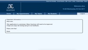
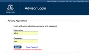
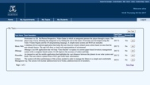
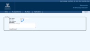
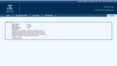
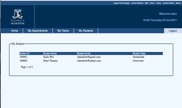
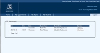
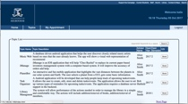
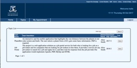
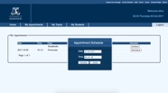
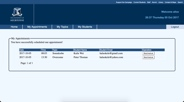
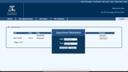
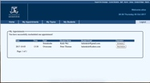
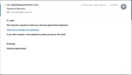
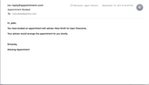
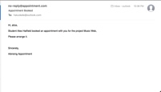
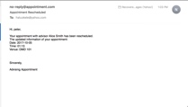

For more details, Please watch [this video](https://youtu.be/MlC1fr39BAM).

 

